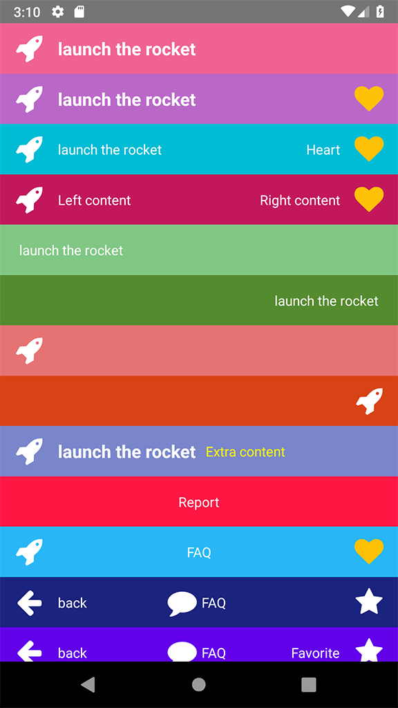

# react-native-flat-header

[](https://www.npmjs.com/package/react-native-flat-header)  

A simple and fully customizable React Native component that implements a Flat-Header UI.

## Install This library :

> npm i react-native-flat-header

### Install `Icon` component(Optional)
* For `icon` Component you can use https://github.com/oblador/react-native-vector-icons

icon use :
```js
import Icon from 'react-native-vector-icons/FontAwesome';

<Icon name="rocket" size={30} color="#FFF" />
```

## Usage :

List of available props for customization FlatHeader component.

|Props  |Value Type  |Description  |
|---------|---------|---------|
| `leftIcon` |Icon Component         |set icon Component         |
| `leftText` |String         |left text string         |
| `leftTextStyle` |Style object         |set style for left text         |
| `leftIconHandler` |handler callback function         |handle for click on left icon, if not set icon does not touchable         |
| `leftTextHandler` |handler callback function        |handle for click on left text, if not set leftText does not touchable         |
| `leftContentHandler` |handler callback function         |handle for click on both leftIcon and leftText together; if set does not need handler icon and text separately         |
| `rightIcon` |Icon Component         |set icon component         |
| `rightIconHandler` |handler callback function         |handle for click on right icon, if not set rightIcon does not touchable         |
| `rightText` |String         |right text string         |
| `rightTextStyle` |Style Object         |set style for right text         |
| `rightTextHandler` |handler callback function         |handle for click on right text, if not set rightText does not touchable         |
| `rightContentHandler` |handler callback function         |handle for click on both rightIcon and rightText together; if set does not need handler icon and text separately         |
| `centerContent` |Group Component         |set Group component that can contain Text and icon component         |
| `centerContentHandler` |handler callback function         |handle for click on centerContent, if not set centerContent does not touchable         |
| `large` |attribute         |if set this attribute, left and right text appear in bold style         |
|`style`  |style object  |set style for main header container, such as background color  |

## Examples:




> ## First of all add below codes to your code (Import Components) :

```js
import { FlatHeader, Group } from 'react-native-flat-header';

//-------For use Icon (must be installed first)
import Icon from 'react-native-vector-icons/FontAwesome';
```

### Simple 1: left icon and text with handlers

```js
<FlatHeader
    leftIcon={<Icon name="rocket" size={30} color="#FFF" />}
    leftIconHandler={() => {
        console.warn('Icon Pressed');
    }}
    leftText="launch the rocket"
    leftTextHandler={() => {
        console.warn('Text Pressed');
    }}
    large
/>
```


### Simple 2: left icon and text with handlers + right icon and right handler

```js
 <FlatHeader
    leftIcon={<Icon name="rocket" size={30} color="#FFF" />}
    leftIconHandler={() => {
        console.warn('Left Icon Pressed');
    }}
    rightIcon={<Icon name="heart" size={30} color="#FFC107" />}
    rightIconHandler={() => {
        console.warn('Right Icon Pressed');
    }}
    leftText="launch the rocket"
    leftTextHandler={() => {
        console.warn('Text Pressed');
    }}
    large
    style={{ backgroundColor: '#BA68C8' }}
    />
```

### Simple 3: left and right icon and text with handlers

```js
 <FlatHeader
    leftIcon={<Icon name="rocket" size={30} color="#FFF" />}
    leftIconHandler={() => {
        console.warn('Left Icon Pressed');
    }}
    leftText="launch the rocket"
    leftTextHandler={() => {
        console.warn('Left Text Pressed');
    }}
    rightIcon={<Icon name="heart" size={30} color="#FFC107" />}
    rightIconHandler={() => {
        console.warn('Right Text Pressed');
    }}
    rightText="Heart"
    rightTextHandler={() => {
        console.warn('Right Icon Pressed');
    }}
    style={{ backgroundColor: '#00BCD4' }}
    />
```

### Simple 4: left and right icon and text + rightContentHandler

```js
<FlatHeader
    leftIcon={<Icon name="rocket" size={30} color="#FFF" />}
    leftText="Left content"
    leftContentHandler={() => {
        console.warn('Left Content Pressed');
    }}
    rightIcon={<Icon name="heart" size={30} color="#FFC107" />}
    rightText="Right content"
    rightContentHandler={() => {
        console.warn('Right Content Pressed');
    }}
    style={{ backgroundColor: '#C2185B' }}
    />
```

### Simple 5: left text

```js
<FlatHeader
    leftText="launch the rocket"
    leftTextHandler={() => {
        console.warn('Text Pressed');
    }}
    style={{ backgroundColor: '#81C784' }}
    />
```

### Simple 6: right text

```js
<FlatHeader
    rightText="launch the rocket"
    rightTextHandler={() => {
        console.warn('Right text Pressed');
    }}
    style={{ backgroundColor: '#558B2F' }}
    />
```

### Simple 7: left icon

```js
<FlatHeader
    leftIcon={<Icon name="rocket" size={30} color="#FFF" />}
    leftIconHandler={() => {
        console.warn('Icon Pressed');
    }}
    style={{ backgroundColor: '#e57373' }}
    />
```

### Simple 8: right icon without handler

```js
<FlatHeader
    rightIcon={<Icon name="rocket" size={30} color="#FFF" />}
    style={{ backgroundColor: '#D84315' }}
    />
```

### Simple 9: left icon and text + Extra content as children that added to left side

```js
<FlatHeader
    leftIcon={<Icon name="rocket" size={30} color="#FFF" />}
    leftIconHandler={() => {
        console.warn('Icon Pressed');
    }}
    leftText="launch the rocket"
    leftTextHandler={() => {
        console.warn('Text Pressed');
    }}
    large
    style={{ backgroundColor: '#7986CB' }}
    >
    <Text style={{ marginLeft: 10, color: 'yellow' }}>
        Extra content
    </Text>
</FlatHeader>
```

### Simple 10: center content

```js
<FlatHeader
    centerContent={<Text style={{ color: '#FFF' }}>Report</Text>}
    style={{ backgroundColor: '#ff1744' }}
    />
```

### Simple 11: left + center content (Just Text Component) + right

```js
<FlatHeader
    leftIcon={<Icon name="rocket" size={30} color="#FFF" />}
    centerContent={<Text style={{ color: '#FFF' }}>FAQ</Text>}
    rightIcon={<Icon name="heart" size={30} color="#FFC107" />}
    style={{ backgroundColor: '#29B6F6' }}
    />
```

### Simple 12: left + center content(Group Component) + right

```js
<FlatHeader
    leftIcon={<Icon name="arrow-left" size={30} color="#FFF" />}
    leftText="back"
    leftContentHandler={() => {
        console.warn('Left both icon and text pressed');
    }}
    centerContent={
        <Group>
            <Icon name="comment" size={30} color="#FFF" />
            <Text style={{ color: '#FFF', paddingHorizontal: 5 }}>FAQ</Text>
        </Group>
    }
    rightIcon={<Icon name="star" size={30} color="#FFF" />}
    style={{ backgroundColor: '#1A237E' }}
    />
```

### Simple 13: Full Example (Advance mode) :

```js
<FlatHeader
    leftIcon={<Icon name="arrow-left" size={30} color="#FFF" />}
    leftText="back"
    leftTextStyle={{ color: 'yellow' }}
    leftContentHandler={() => {
        console.warn('Left both icon and text pressed-Left Content');
    }}
    centerContent={
        <Group>
        <Icon name="comment" size={30} color="#FFF" />
        <Text style={{ color: '#FFF', paddingHorizontal: 5 }}>FAQ</Text>
        </Group>
    }
    centerContentHandler={() => console.warn('center content pressed')}
    rightIcon={<Icon name="star" size={30} color="#FFF" />}
    rightText="Favorite"
    rightTextStyle={{ color: 'yellow' }}
    rightContentHandler={() => {
        console.warn('right both icon and text pressed-Right Content');
    }}
    large={false}
    style={{ backgroundColor: '#6200EA' }}
    />
```

## Full Screen Example :

```js
import React, { Component } from 'react';
import { StyleSheet, Text, View, ScrollView } from 'react-native';

import Icon from 'react-native-vector-icons/FontAwesome';
import { FlatHeader, Group } from 'react-native-flat-header';

export default class App extends Component {
  render() {
    return (
      <View style={styles.container}>
        <FlatHeader
            leftIcon={<Icon name="arrow-left" size={30} color="#FFF" />}
            leftText="back"
            leftTextStyle={{ color: 'yellow' }}
            leftContentHandler={() => {
                console.warn('Left both icon and text pressed-Left Content');
            }}
            centerContent={
                <Group>
                <Icon name="comment" size={30} color="#FFF" />
                <Text style={{ color: '#FFF', paddingHorizontal: 5 }}></Text>FAQ</Text>
                </Group>
            }
            centerContentHandler={() => console.warn('center content pressed')}
            rightIcon={<Icon name="star" size={30} color="#FFF" />}
            rightText="Favorite"
            rightTextStyle={{ color: 'yellow' }}
            rightContentHandler={() => {
                console.warn('right both icon and text pressed-Right Content');
            }}
            style={{ backgroundColor: '#6200EA' }}
        />
      </View>
    );
  }
}

const styles = StyleSheet.create({
  container: {
    flex: 1,
    backgroundColor: '#F5FCFF'
  },
});

```
